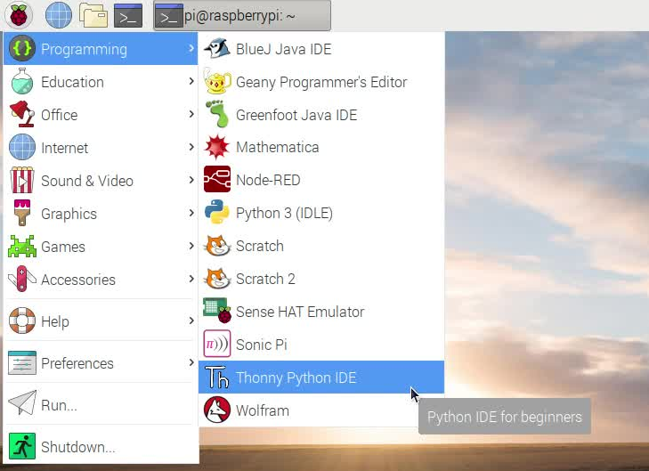

## Programming the robot

- Once you are connected to the Raspberry Pi via the VNC, you should see the usual Raspberry Pi desktop in a window on your computer.

- Open up **Thonny** from the **Programming** menu:

    

- Begin your code by importing the Explorer HAT library and the sleep function from the time library:

    ```python
    import explorerhat
    from time import sleep
    ```

- Underneath that, add some test code to make the buggy move forwards for two seconds:

    ```python
    explorerhat.motor.one.forward(100)
    explorerhat.motor.two.forward(100)

    sleep(2)

    explorerhat.motor.one.stop()
    explorerhat.motor.two.stop()
    ```

- Make sure your buggy is in a good place to be able to move, then save your code and press F5 to run it. Your buggy should move forwards for a short distance.

- Can you figure out how to make your robot do the following:

    - Move backwards
    - Move for a longer length of time
    - Move more slowly
    - Turn left and right?


